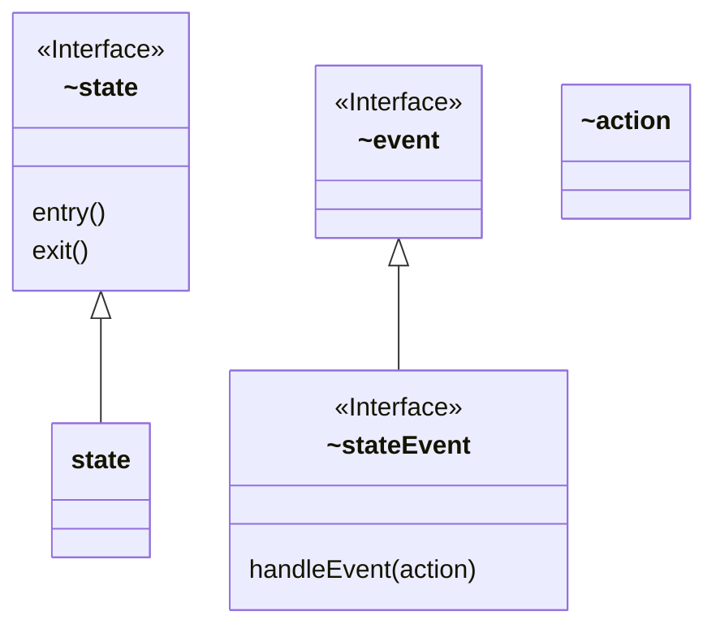

# stateMachine

```mermaid
classDiagram

class istate["~state"]{
  <<Interface>>
  entry()
  exit()
}

class state

class istateEvent["~stateEvent"]{
  <<Interface>>
  handleEvent(action)
}

class ievent["~event"]{
  <<Interface>>
}

class iaction["~action"]

istate <|-- state
ievent <|-- istateEvent

```
